# Beautiful Graphics
`r format(Sys.time(), '%d %B %Y')`  


The is http://www.sthda.com/english/wiki/ggplot2-essentials.

# Introduction
## Installing and Loading ggplot2

```r
warning("Use type = 'source' only if you have configured a C++ compiler.")

local({
  r = getOption("repos")
  r["CRAN"] = "https://cran.rstudio.com/"
  r["CRANextra"] <- "http://www.stats.ox.ac.uk/pub/RWin"
  r["CRAN_de"] <- "https://cran.uni-muenster.de/"
  options(repos = r)
})

install.packages(
  pkgs = "ggplot2", 
  dependencies = TRUE,
  type = "source")

library(ggplot2)
```

- - -

# Introduction to ggplot2
## Terms
A plot can be divided into **3** fundumental parts:
**Plot = data + Aesthetics + Geometry**.

- **data**: a data frame
- **Aesthetics**: describe the mapping of variables to visual properties of geometry.
    1. indicate the x and y variables,  
    2. control color, size, shape of points, etc. 
- **Geometry**: describe the type of graphic, e.g. histogram, box plot, line plot, scatter plot, etc.

Geometry is defined in geom_*(). Geoms are called layers cause the can occur multiple times and put on top of each other.

### Further reading
- http://docs.ggplot2.org/0.9.3/aes.html
- http://docs.ggplot2.org/current/vignettes/ggplot2-specs.html

## Data format and preparation
- **Data must be a data frame, containing all information to make a ggplot graphic.**  
- **Data should be tidy, i. e. columns should be variables, rows should be observations.**  


```r
# mtcars
## Load data
data(mtcars)
df <- mtcars[ , c("mpg", "cyl", "wt")]

## Convert dyl to a factor variable
df$cyl <- as.factor(df$cyl)

## Print a sample of data
head(mtcars)
```

```
##                    mpg cyl disp  hp drat    wt  qsec vs am gear carb
## Mazda RX4         21.0   6  160 110 3.90 2.620 16.46  0  1    4    4
## Mazda RX4 Wag     21.0   6  160 110 3.90 2.875 17.02  0  1    4    4
## Datsun 710        22.8   4  108  93 3.85 2.320 18.61  1  1    4    1
## Hornet 4 Drive    21.4   6  258 110 3.08 3.215 19.44  1  0    3    1
## Hornet Sportabout 18.7   8  360 175 3.15 3.440 17.02  0  0    3    2
## Valiant           18.1   6  225 105 2.76 3.460 20.22  1  0    3    1
```

```r
#----------------------------------------------------------
library(dplyr)
```

```
## 
## Attaching package: 'dplyr'
```

```
## The following objects are masked from 'package:stats':
## 
##     filter, lag
```

```
## The following objects are masked from 'package:base':
## 
##     intersect, setdiff, setequal, union
```

```r
set.seed(1234)
wdata <- data.frame(
  sex = factor(rep(c("F", "M"), each = 200)),
  weight = c(rnorm(200, 55), rnorm(200, 58)))

head(wdata)
```

```
##   sex   weight
## 1   F 53.79293
## 2   F 55.27743
## 3   F 56.08444
## 4   F 52.65430
## 5   F 55.42912
## 6   F 55.50606
```

```r
mu <- wdata %>%
  group_by(sex) %>%
  summarise(grp.mean = mean(weight))

head(mu)
```

```
## # A tibble: 2 x 2
##      sex grp.mean
##   <fctr>    <dbl>
## 1      F 54.94224
## 2      M 58.07325
```

## ggplot Basics
### ggplot basic example

```r
library(ggplot2)
# Basic scatter plot
ggplot(data = mtcars, aes(x = wt, y = mpg)) +
  geom_point()
```

<!-- -->

```r
# Change the font size and shape
ggplot(data = mtcars, aes(x = wt, y = mpg)) +
   geom_point(size = 1.5, shape = 18)
```

<!-- -->

### aes_string()
aes_string() generates aesthetics from a string. This is particularly useful when writing functions that create plots cause strings can be used to define aesthetic mappings. Otherwise it would be needed to use a substitute to generate a call to aes().


```r
ggplot(data = mtcars, aes_string(x = "wt", y = "mpg")) +
   geom_point(size = 1.5, shape = 18)
```

<!-- -->

```r
ggpoints <- function(data, x_name, y_name)
{
  p <- ggplot(data = data, aes_string(x_name, y_name)) +
    geom_point(color = "red") +
    geom_smooth()
  
  return(p)
}

ggpoints(data = mtcars, x_name = "wt", y_name = "mpg")
```

```
## `geom_smooth()` using method = 'loess'
```

<!-- -->

### Visualise transformations of original dataset
Some plots visualise a transformation on the original data set. In this case, an alternative way to build a layer is to use stat_*() functions.


```r
set.seed(1234)
wdata = data.frame(
  sex = factor(rep(c("F", "M"), each = 200)),
  weight = c(rnorm(200, 55), rnorm(200, 58)))

print("Use geometry function")
```

```
## [1] "Use geometry function"
```

```r
ggplot(wdata, aes(x = weight)) + geom_density()
```

<!-- -->

```r
print("Use stat function")
```

```
## [1] "Use stat function"
```

```r
ggplot(wdata, aes(x = weight)) + stat_density()
```

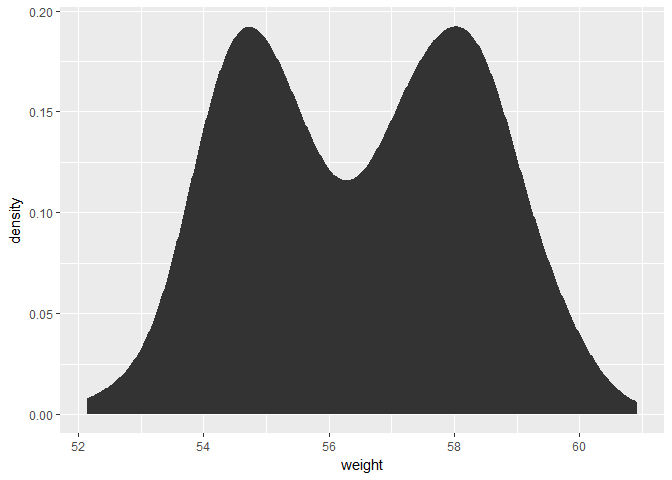<!-- -->

### Layers using geoms
Each plot consists of one or more layers. Layers are defined using geom_*().

#### Using the same data and same aesthetic mapping in one plot

```r
ggplot(data = mtcars, aes(x = wt, y = mpg)) +
  geom_point() +  # to draw points
  geom_line()     # to draw a line
```

<!-- -->

#### Using different data and mappings for different layers

```r
ggplot(data = mtcars, aes(x = wt, y = mpg)) +
  geom_point() +  # to draw points from whole data set
  geom_line(data = head(mtcars), color = "red")  # to draw a line from a subset of data
```

<!-- -->

### Calculations in aes()

```r
ggplot(data = mtcars, aes(x = log2(wt), y = log2(mpg))) +
  geom_point()
```

<!-- -->

### Saving plots
- Plots can be stored as a variable and printed using print().  
- last_plot(): returns last plot modified  
- ggsave("plot.png", width = 5, height = 5): save the last plot to the current working directory  

#### Saving directly from screen

```r
ggplot(mtcars, aes(wt, mpg)) + geom_point()
```

<!-- -->

```r
ggsave("my_plot1.pdf")  # to PDF
```

```
## Saving 7 x 5 in image
```

```r
ggsave("my_plot1.png")  # to PNG
```

```
## Saving 7 x 5 in image
```

#### Saving graphic objects

```r
pdf("my_plot2.pdf")
my_plot <- ggplot(mtcars, aes(wt, mpg)) + geom_point()
print(my_plot)
dev.off()
```

```
## png 
##   2
```

```r
png("my_plot2.png")
my_plot <- ggplot(mtcars, aes(wt, mpg)) + geom_point()
print(my_plot)
dev.off()
```

```
## png 
##   2
```
- - -

# Plotting **ONE** variable (discrete or continuous)


```r
library(dplyr)

set.seed(1234)
wdata <- data.frame(
  sex = factor(rep(c("F", "M"), each = 200)),
  weight = c(rnorm(200, 55), rnorm(200, 58)))

head(wdata)
```

```
##   sex   weight
## 1   F 53.79293
## 2   F 55.27743
## 3   F 56.08444
## 4   F 52.65430
## 5   F 55.42912
## 6   F 55.50606
```

```r
mu <- wdata %>%
  group_by(sex) %>%
  summarise(grp.mean = mean(weight))

head(mu)
```

```
## # A tibble: 2 x 2
##      sex grp.mean
##   <fctr>    <dbl>
## 1      F 54.94224
## 2      M 58.07325
```


```r
my_plot <- ggplot(wdata, aes(x = weight))
```

## Overview of possible graphics

### Discrete Variables

- geom_bar():       bar plot

### Continuous Variables

- geom_area():      area plot
- geom_density():   density plot
- geom_dotplot():   dot plot
- geom_freqpoly():  frequency polygon
- geom_histogram(): histogram plot
- geom_ecdf():      empirical cumulative density function
- stat_qq():        quantile-quantile plot

## Bar plot
### Basics
- Definition: Bar plot can be used to visualise one discrete variable. A count of each level is plotted.
- Key functions: geom_bar()
- Alternvative function: stat_count()
- Key arguments: alpha, color, fill, linetype, size

### Example

```r
data(mpg)
ggplot(mpg, aes(fl)) +
  geom_bar(fill = "steelblue") +
  theme_minimal()
```

<!-- -->

## Area Plot
### Basics
- Definition: Area plots are the continuous analog to a stacked bar chart.
- Key function: geom_area()
- Alternative function: stat_bin()
- Key arguments: alpha, color, fill, linetype, size

### Example 1: y Values Corresponding to the Count of x Values


```r
my_plot + geom_area(stat = "bin", color = "black", fill = '#00AFBB')
```

```
## `stat_bin()` using `bins = 30`. Pick better value with `binwidth`.
```

<!-- -->

### Example 2: y Values Corresponding to the Density of x Values

```r
my_plot + geom_area(aes(y = ..density..), stat = "bin")
```

```
## `stat_bin()` using `bins = 30`. Pick better value with `binwidth`.
```

<!-- -->

### Comparison of Bar Plot and Area Plot

```r
data("diamonds")
head(diamonds)
```

```
## # A tibble: 6 x 10
##   carat       cut color clarity depth table price     x     y     z
##   <dbl>     <ord> <ord>   <ord> <dbl> <dbl> <int> <dbl> <dbl> <dbl>
## 1  0.23     Ideal     E     SI2  61.5    55   326  3.95  3.98  2.43
## 2  0.21   Premium     E     SI1  59.8    61   326  3.89  3.84  2.31
## 3  0.23      Good     E     VS1  56.9    65   327  4.05  4.07  2.31
## 4  0.29   Premium     I     VS2  62.4    58   334  4.20  4.23  2.63
## 5  0.31      Good     J     SI2  63.3    58   335  4.34  4.35  2.75
## 6  0.24 Very Good     J    VVS2  62.8    57   336  3.94  3.96  2.48
```

```r
p <- ggplot(diamonds, aes(x = price, fill = cut))

p + geom_bar(stat = "bin")
```

```
## `stat_bin()` using `bins = 30`. Pick better value with `binwidth`.
```

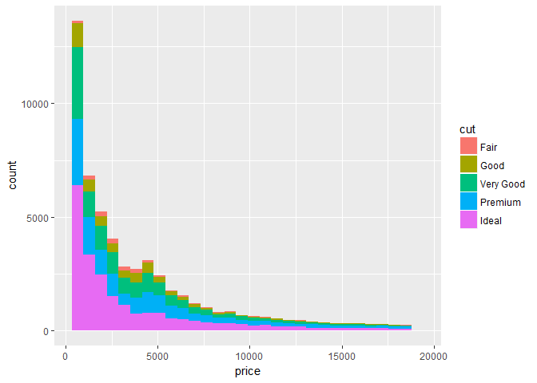<!-- -->

```r
p + geom_area(stat = "bin")
```

```
## `stat_bin()` using `bins = 30`. Pick better value with `binwidth`.
```

<!-- -->

## Density Plot
### Basics
- Density plots are useful to visualise the distribution of a continuous variable.
- Key function: geom_density()
- Alternative function: stat_density()
- Key arguments: alpha, color, fill, linetype, size
- References
    1. https://en.wikipedia.org/wiki/Density_estimation
    2. https://de.wikipedia.org/wiki/Kerndichtesch%C3%A4tzer

### Example 1

```r
my_plot + geom_density()
```

<!-- -->

```r
my_plot + geom_density(color = "black", fill = "grey") +
  geom_vline(aes(xintercept = mean(weight)),
             color = "#FC4E07", 
             linetype = "dashed",
             size = 1)
```

<!-- -->

### Groupings
#### Example 1: Line Color by Sex

```r
my_plot + geom_density(aes(color = sex))
```

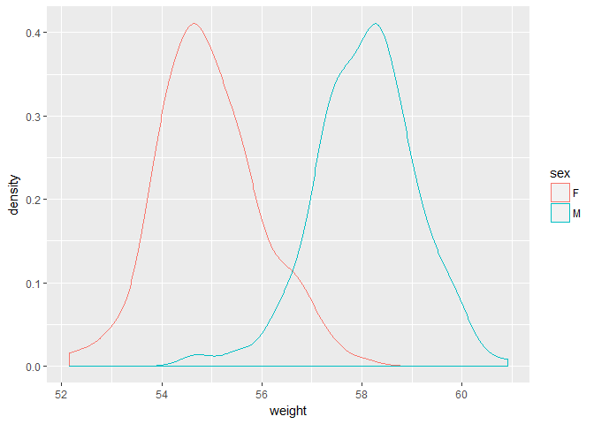<!-- -->

#### Example 2: Fill Color by Sex, semi-transparent fill (alpha = 0.4)

```r
my_plot + geom_density(aes(fill = sex), 
                       alpha = 0.4)
```

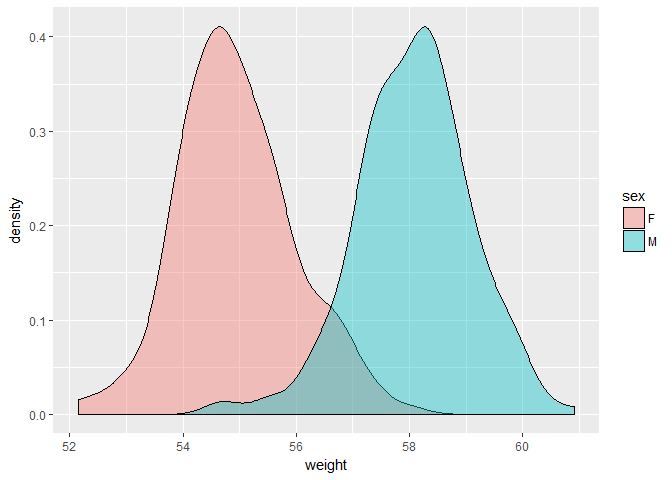<!-- -->

#### Example 3: Line Color and Mean Line by Sex

```r
head(mu)
```

```
## # A tibble: 2 x 2
##      sex grp.mean
##   <fctr>    <dbl>
## 1      F 54.94224
## 2      M 58.07325
```

```r
my_plot + geom_density(aes(color = sex), 
                        alpha = 0.4) +
  geom_vline(data = mu,
             aes(xintercept = grp.mean, 
                 color = sex),
             linetype = "dashed")
```

<!-- -->

### Graphic Property Control
#### Basics
- scale_color_manual(), scale_fill_manual(): use custom colors
- scale_color_brewer(), scale_fill_brewer(): use color palette from RColorBrewer package
- scale_color_grey(), scale_fill_grey():     use grey color palettes

#### Manually Defined Lines
##### Example 0: Create Basic Graphic

```r
my_plot_2 <- my_plot + 
  geom_density(aes(color = sex)) +
  geom_vline(data = mu,
             aes(xintercept = grp.mean, 
                 color = sex),
             linetype = "dashed") +
  theme_minimal()
```

##### Example 1: Manually Defined Color

```r
my_plot_2 + scale_color_manual(values = c("#999999", "#E69F00"))
```

<!-- -->

##### Example 2: Colors Using RColorBrewer Palettes

```r
my_plot_2 + scale_color_brewer(palette = "Paired")
```

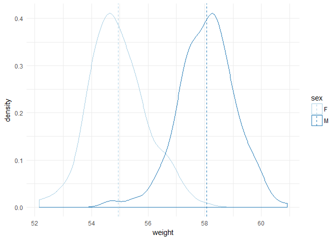<!-- -->

##### Example 3: Grey Scale

```r
my_plot_2 + scale_color_grey()
```

<!-- -->

#### Manually Defined Fills
##### Example 0: Create Basic Graphic

```r
my_plot_3 <- my_plot + 
  geom_density(aes(fill = sex), alpha = 0.4) +
  theme_minimal()
```

##### Example 1: Manuall Fill

```r
my_plot_3 + scale_fill_manual(
  values = c("#999999", "#E69F00"))
```

<!-- -->

##### Example 2: Fill with RColorBrewer Palettes Colors

```r
my_plot_3 + scale_fill_brewer(palette = "Dark2") +
  theme_minimal()
```

<!-- -->

##### Example 3: Fill with Grey Scale Colors

```r
my_plot_3 + scale_fill_grey() +
  theme_minimal()
```

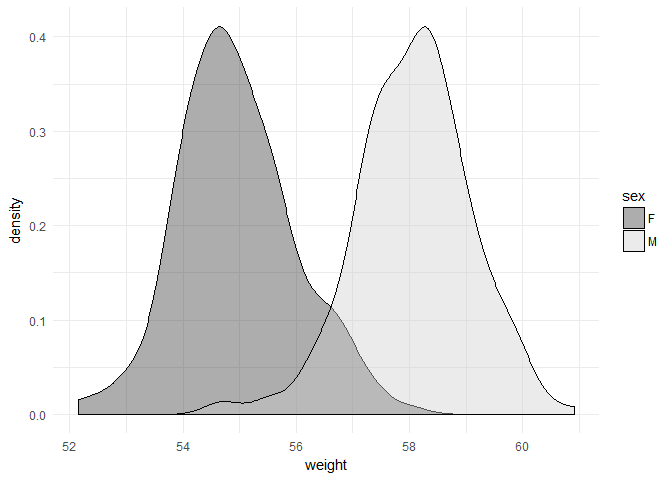<!-- -->

## Dot Plot
### Basics
- Definition: Each observation in a dot plot represents a dot. Dot plots are used to visualise one variable.
Key function: geom_dotplot()
Alternative function: none
Key arguments: alpha, color, fill, dotsize

### Example

```r
library(ggplot2)
set.seed(1234)
wdata <- data.frame(
  sex = factor(rep(c("F", "M"), each = 200)),
  weight = c(rnorm(200, 55), rnorm(200, 58)))
head(wdata)
```

```
##   sex   weight
## 1   F 53.79293
## 2   F 55.27743
## 3   F 56.08444
## 4   F 52.65430
## 5   F 55.42912
## 6   F 55.50606
```

```r
myplot <- ggplot(wdata, aes(x = weight))
myplot + geom_dotplot(
  aes(fill = sex))
```

```
## `stat_bindot()` using `bins = 30`. Pick better value with `binwidth`.
```

<!-- -->

## Frequency Polygon
### Basics
- Definition: Frequency Polygons are used to visualise the distribution of a continuous variable. It is similar to histogram plots but instead of using bars frequency polygons use lines.
Key function: geom_freqpoly()
Alternative function: stat_bin()
Key arguments: alpha, color, linetype, size

### Example 1

```r
library(ggplot2)
set.seed(1234)
wdata <- data.frame(
  sex = factor(rep(c("F", "M"), each = 200)),
  weight = c(rnorm(200, 55), rnorm(200, 58)))
head(wdata)
```

```
##   sex   weight
## 1   F 53.79293
## 2   F 55.27743
## 3   F 56.08444
## 4   F 52.65430
## 5   F 55.42912
## 6   F 55.50606
```

#### Basic plot

```r
myplot <- ggplot(wdata, aes(x = weight))
myplot + geom_freqpoly(bins = 30) +
  theme_minimal()
```

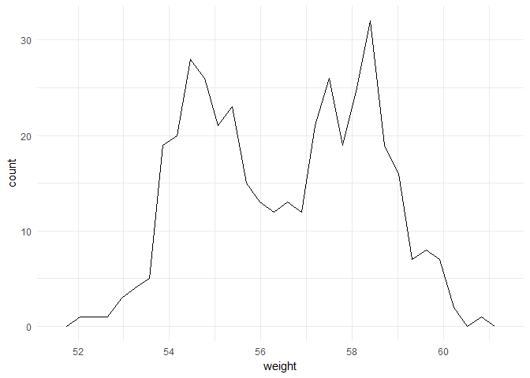<!-- -->

#### Change color and linetype by sex, use custom color palettes

```r
myplot + geom_freqpoly(
  aes(
    color = sex,
    linetype = sex)) +
  scale_color_manual(values = c("#999999", "#E69F00")) +
  theme_minimal()
```

```
## `stat_bin()` using `bins = 30`. Pick better value with `binwidth`.
```

<!-- -->

#### Plot density on y-axis

```r
myplot + geom_freqpoly(aes(y = ..density..))
```

```
## `stat_bin()` using `bins = 30`. Pick better value with `binwidth`.
```

<!-- -->

## Histogram Plot
### Basics
- Definition: Histogram plots represent a distribution of a continuous variable by dividing into bins and counting the number of observations in each bin.
- Key function: geom_histogram()
- Alternative function: stat_bin()
- Key arguments: alpha, color, fill, linetype, size
- Adjustments: "identity" (or position_identity()), "stack" (or position_stack()), "dodge" (or position_dodge())
- Defaults: "stack", bins = 30, y axis = count

#### Example 1: y Values Corresponding to the Count of x Values
##### Basic plot

```r
my_plot + geom_histogram()
```

```
## `stat_bin()` using `bins = 30`. Pick better value with `binwidth`.
```

<!-- -->

###### Change the number of bins

```r
my_plot + geom_histogram(bins = 50)
```

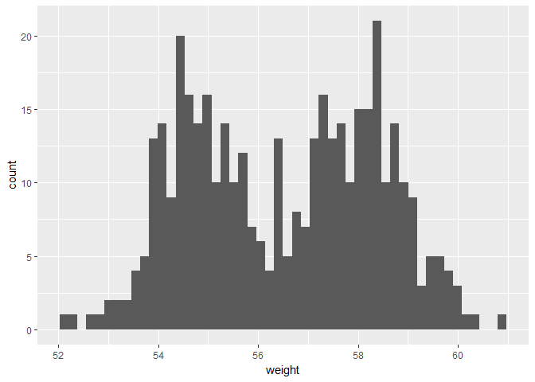<!-- -->

###### Change line color and fill color, add mean line

```r
my_plot + 
  geom_histogram(color = "black", fill = "grey") +
  geom_vline(
    aes(xintercept = mean(weight)),
    color = "#FC4E07",
    linetype = "dashed",
    size = 1)
```

```
## `stat_bin()` using `bins = 30`. Pick better value with `binwidth`.
```

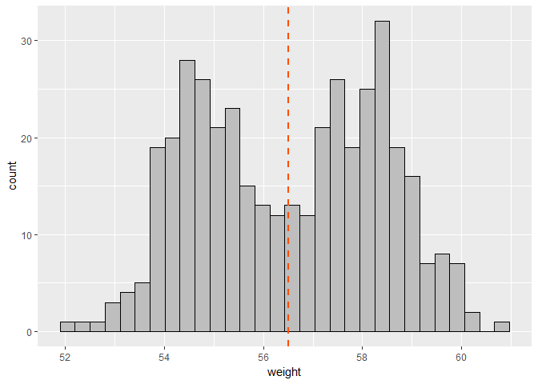<!-- -->

**Note**
Instead of changing the number of bins with bins = <number> the bindwidth can be changed using binswidth = <number>.

#### Example 2: y Values Corresponding to the density of x Values

```r
my_plot + geom_histogram(aes(y = ..density..))
```

```
## `stat_bin()` using `bins = 30`. Pick better value with `binwidth`.
```

<!-- -->

### Change Colors by Groups
#### Change line colors by sex

```r
my_plot + geom_histogram(
  aes(color = sex), 
  fill = "white",
  position = "stack")  # "stack" is default
```

```
## `stat_bin()` using `bins = 30`. Pick better value with `binwidth`.
```

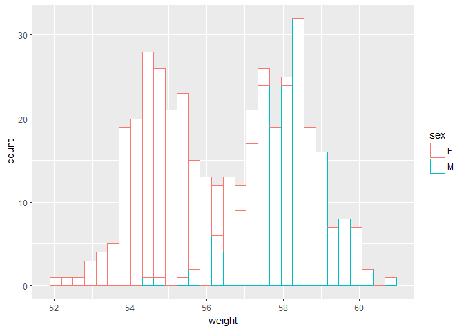<!-- -->

#### Position adjustment "identity" (overlaid)

```r
my_plot + 
  geom_histogram(
    aes(color = sex),
    fill = "white",
    alpha = 0.6,
    position = "identity")
```

```
## `stat_bin()` using `bins = 30`. Pick better value with `binwidth`.
```

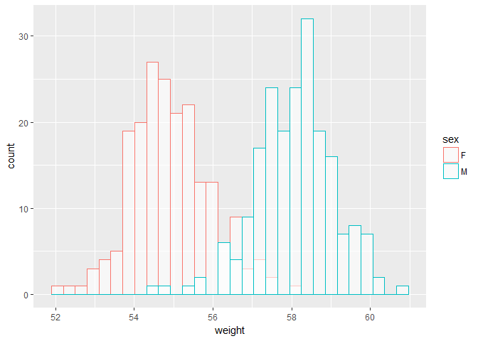<!-- -->

#### Position adjustment: "dodge" (interleaved) and mean lines by sex

```r
my_plot + 
  geom_histogram(
    aes(color = sex),
    fill = "white",
    position = "dodge") +
  geom_vline(
    data = mu,
    aes(xintercept = grp.mean,
        color = sex),
    linetype = "dashed")
```

```
## `stat_bin()` using `bins = 30`. Pick better value with `binwidth`.
```

<!-- -->

### Graphic Property Control
#### Basics
- scale_color_manual(), scale_fill_manual(): use custom colors  
- scale_color_brewer(), scale_fill_brewer(): use color palette from RColorBrewer package  
- scale_color_grey(), scale_fill_grey(): use grey color palettes  

#### Manually Defined Lines
##### Example 1: Change outline color manually

```r
my_plot + 
  geom_histogram(
    aes(color = sex),
    fill = "white",  # fill IN geom NOT in aes !!!
    alpha = 0.4,
    position = "identity") +
  scale_color_manual(values = c("#00AFBB", "#E7B800"))
```

```
## `stat_bin()` using `bins = 30`. Pick better value with `binwidth`.
```

<!-- -->

##### Example 2: Change fill and outline color manually

```r
my_plot + 
  geom_histogram(
    aes(color = sex,
        fill = sex),  # fill NOT in geom BUT in aes !!!
    alpha = 0.4,
    position = "identity") +
  scale_fill_manual(values = c("#00AFBB", "#E7B800")) +
  scale_color_manual(values = c("#00AFBB", "#E7B800"))
```

```
## `stat_bin()` using `bins = 30`. Pick better value with `binwidth`.
```

<!-- -->

### Combine Histogram and Density Plots
- Plot histogram with density values on y-axis (instead of count values).
- Add density plot with transparent density plot.

#### Histogram with Density Plot
- Histogram with transparent filled density plot overlaid.


```r
my_plot + 
  geom_histogram(
    aes(y = ..density..),
    color = "black",  # color IN geom NOT in aes
    fill = "white") +  # fill in geam NOT in aes
  geom_density(
    alpha = 0.2,
    fill = "#FF6666")
```

```
## `stat_bin()` using `bins = 30`. Pick better value with `binwidth`.
```

<!-- -->

#### Histogram with color by groups
- Histogram with line density plot overlaid.


```r
my_plot + 
  geom_histogram(
    aes(
      y = ..density..,
      color = sex,  # color NOT in geom BUT in aes
      fill = sex),  # fill  NOT in geom BUT in aes
    alpha = 0.5,
    position = "identity") + 
  geom_density(
    aes(color = sex),
    size = 1)
```

```
## `stat_bin()` using `bins = 30`. Pick better value with `binwidth`.
```

<!-- -->

## ECDF plots
### Basics
- Definition: ECDF plots report for any given number the percent of individuals that are below that threshold.
- Key function: stat_ecdf()
- Alternative function: none
- Key arguments: alpha, color, linetype, size

### Examples

```r
library(ggplot2)
set.seed(1234)
wdata <- data.frame(
  sex = factor(rep(c("F", "M"), each = 200)),
  weight = c(rnorm(200, 55), rnorm(200, 58)))
head(wdata)
```

```
##   sex   weight
## 1   F 53.79293
## 2   F 55.27743
## 3   F 56.08444
## 4   F 52.65430
## 5   F 55.42912
## 6   F 55.50606
```

```r
my_plot <- ggplot(wdata, aes(x = weight))
my_plot + stat_ecdf(geom = "point")
```

<!-- -->

```r
my_plot + stat_ecdf(geom = "step")
```

<!-- -->

## QQ Plot
### Basics
- Definition: QQ plots are used to check whether a given data follows normal distribution. 
- Key function: stat_qq()
- Alternvative function: qplot()
- Key arguments: alpha, color, shape, size

### Examples

```r
data(mtcars)
mtcars$cyl <- as.factor(mtcars$cyl)
head(mtcars[ , c("mpg", "cyl")])
```

```
##                    mpg cyl
## Mazda RX4         21.0   6
## Mazda RX4 Wag     21.0   6
## Datsun 710        22.8   4
## Hornet 4 Drive    21.4   6
## Hornet Sportabout 18.7   8
## Valiant           18.1   6
```

```r
my_plot <- ggplot(mtcars, aes(sample = mpg))

my_plot + stat_qq()
```

<!-- -->

**? Where does "sample" in aes() come from?***


```r
my_plot + stat_qq(
  aes(
    shape = cyl, color = cyl))  + 
    scale_color_manual(
      values = c("#00AFBB", "#E7B800", "#FC4E07"))
```

<!-- -->

# Plotting TWO variables X and Y (discrete or continuous)

```r
library(ggplot2)
data(mtcars)
mtcars$cyl <- as.factor(mtcars$cyl)
head(mtcars[ , c("wt", "mpg", "cyl")])
```

```
##                      wt  mpg cyl
## Mazda RX4         2.620 21.0   6
## Mazda RX4 Wag     2.875 21.0   6
## Datsun 710        2.320 22.8   4
## Hornet 4 Drive    3.215 21.4   6
## Hornet Sportabout 3.440 18.7   8
## Valiant           3.460 18.1   6
```

```r
my_plot <- ggplot(
  mtcars,
  aes(x = wt,
      y = mpg))
```

## Scatter for continuous X and Y
### Basics
- Defintion: The data is displayed as a collection of points, each having the value of one variable determining the position on the horizontal axis and the value of the other variable determining the position on the vertical axis. If the points are color-coded, one additional variable can be displayed.[^1]
- Key function: geom_point()
- Alternative function: none
- Key arguments: alpha, color, fill, shape, size

### Plot types
- geom_point(): scatter plot
- geom_smooth(): adding a smooth line, e. g. a regression line
- geom_quantile(): adding quantile lines
- geom_rug(): adding marginal rug
- geom_jitter(): avoiding overplotting
- geom_text(): adding textual annotations

### Graphic Property Control
- The main poperties can be controlled by:  

geom_point(  
size,
color,
shape)

- The size can be controlled by a third (continuous) variable.  

### Examples

```r
my_plot + geom_point(color = "#00AFBB")
```

<!-- -->

```r
my_plot + geom_point(color = "#00AFBB", size = 2, shape = 23)
```

<!-- -->

```r
my_plot + geom_point(
  aes(size = qsec),
  color = "#00AFBB")
```

<!-- -->

```r
my_plot + geom_point() +
  geom_text(
    label = rownames(mtcars),
    nudge_x = 0.5)
```

<!-- -->

### Scatter Plot With Multiple Groups
#### Control Graphic Properties AUTOMATICALLY With A Variable

```r
my_plot + geom_point(
  aes(shape = cyl))
```

<!-- -->

```r
my_plot + geom_point(
  aes(shape = cyl,
      color = cyl))
```

<!-- -->

```r
my_plot + geom_point(
  aes(shape = cyl,
      color = cyl,
      size = cyl))
```

```
## Warning: Using size for a discrete variable is not advised.
```

<!-- -->

#### Control Graphic Properites MANUALLY
##### Functions
- scale_shape_manual()  
- scale_color_manual()  
- scale_size_manual()

##### Examples

```r
my_plot + geom_point(
  aes(
    color = cyl,
    shape = cyl,
    size = cyl)) +
  scale_size_manual(values = c(2, 3, 4))
```

<!-- -->

```r
my_plot + geom_point(
   aes(
    color = cyl,
    shape = cyl)) +
  scale_size_manual(values = c(3, 16, 17)) +
  scale_color_manual(values = c("#999999", "#E69F00", "#56B4E9"))
```

<!-- -->

#### Control Graphic Properties Using Palettes
##### Functions
- scale_color_grey()
- scale_color_brewer()

##### Examples

```r
my_plot + geom_point(
  aes(
    color = cyl,
    shape = cyl)) +
  scale_color_grey() +
  theme_minimal()
```

<!-- -->

```r
my_plot + geom_point(
  aes(
    color = cyl,
    shape = cyl)) +
  scale_color_brewer(palette = "Dark2") +
  theme_minimal()
```

<!-- -->

### Add Regression Line OR Smoothed Conditional Mean
#### Basics
- Definition: ????  
- Key function: geom_smooth(), geom_abline()  
- Alternative function: stat_smooth()  
- Key arguments: alpha, color, fill, shape, linetype, size  

#### General Format
geom_smooth(
- method: used smoothing method. Values are "auto", "loess", "lm", "glm", "gam", "rlm" or a formula like "y ~ poly(x, 3)" to specify a degree 3 polynominal.  
- se (logical): If TRUE confidence interval is displayed around smooth. - fullrange (logical): If TRUE the fit spans the full range of the plot.  
- level (numeric): Level of confidence intervall to use. Default is 0.95.
)  

#### Models
- loess: Is the default value for a small number of observations. It computes a smooth logical regression.
- lm: Is the linear model.

#### Examples

```r
# loess method, local regression fitting
my_plot + geom_point() +
  geom_smooth()
```

```
## `geom_smooth()` using method = 'loess'
```

<!-- -->

```r
# Point + regression line
# Remove the confidence intervall
my_plot + geom_point() +
  geom_smooth(
    method = lm,
    se = FALSE)
```

<!-- -->

```r
# Add regression line
# Default confidence intervall
my_plot + geom_point() +
  geom_smooth(method = lm)
```

<!-- -->

### Change Colors By Groups

```r
# Change color and shape by group
my_plot + geom_point(
  aes(
    color = cyl,
    shape = cyl)) + 
  geom_smooth(
    aes(color = cyl,
        fill = cyl),
    method = lm)
```

<!-- -->

```r
# Remove confidence intervals
# Extend the regression lines to full plot range
my_plot + geom_point(
  aes(
    color = cyl,
    shape = cyl)) + 
  geom_smooth(
    aes(color = cyl),
    method = lm,
    se = FALSE,
    fullrange = TRUE)
```

<!-- -->

### Add Quantile Lines From a Quantile Regression
#### Basics
- Definition: Quantile lines can be used as a continuous analogue of a geom_boxplot().  
- Key function: geom_quantile()
- Alternative function: stat_quantile()
- Key arguments: alpha, color, linetype, size

#### Example

```r
ggplot(
  mpg,
  aes(cty, hwy)) +
  geom_point() + 
  geom_quantile() +
  theme_minimal()
```

```
## Loading required package: SparseM
```

```
## 
## Attaching package: 'SparseM'
```

```
## The following object is masked from 'package:base':
## 
##     backsolve
```

```
## Smoothing formula not specified. Using: y ~ x
```

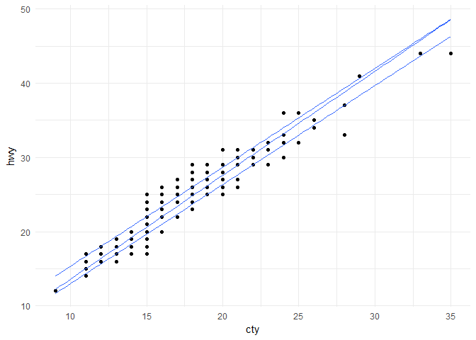<!-- -->

### Add Marginal Rug To Scatter Plot
#### Basics
- Key functions: geom_rug()  
- Key arguments: alpha, color, size

#### Values For Size
Size can have a string containing any of "trbl" with stands for

- t = TOP  
- r = right  
- b = BOTTOM  
- l = left  

#### Examples

```r
# Add marginal rug
my_plot + geom_point() +
  geom_rug()
```

<!-- -->

```r
# Change colors by group
my_plot + geom_point(
  aes(color = cyl)) +
  geom_rug(aes(color = cyl))
```

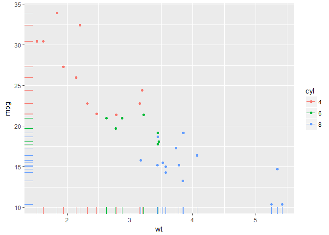<!-- -->

```r
# Add marginal rugs using faithful data
data(faithful)
ggplot(
  faithful,
  aes(x = eruptions,
      y = waiting)) +
  geom_point() +
  geom_rug()
```

<!-- -->

### Use Jitter Points To Reduce Overplotting
#### Basics
- Key functions: geom_jitter(), position_jitter()  
- Key arguments: alpha, color, fill, shape, size  

To adjust the extend of jittering the function position_jitter() with the arguments

- width: degree of jitter in x direction  
- height: degree of jitter in y direction   

is used.

#### Examples

```r
my_plot <- ggplot(
  mpg,
  aes(
    x = displ,
    y = hwy))

# Default scatter plot
my_plot + geom_point()
```

<!-- -->

```r
# Use jitter to reduce overplotting
my_plot + geom_jitter(
  position = position_jitter(
    width = 0.5,
    height = 0.5))
```

<!-- -->

### Textual Annotations
#### Basics
- Key functions: geom_text()
- Key arguments: alpha, angel, label, color, family, fontface, hjust, lineheight, size, vjust

The argument "label" is used to specify a vector of labels for point annotations.

#### Example

```r
library(ggplot2)
data(mtcars)
mtcars$cyl <- as.factor(mtcars$cyl)
head(mtcars[ , c("wt", "mpg", "cyl")])
```

```
##                      wt  mpg cyl
## Mazda RX4         2.620 21.0   6
## Mazda RX4 Wag     2.875 21.0   6
## Datsun 710        2.320 22.8   4
## Hornet 4 Drive    3.215 21.4   6
## Hornet Sportabout 3.440 18.7   8
## Valiant           3.460 18.1   6
```

```r
my_plot <- ggplot(
  mtcars,
  aes(x = wt,
      y = mpg))

my_plot + geom_text(
  aes(
    label = rownames(mtcars)),
  size = 3)
```

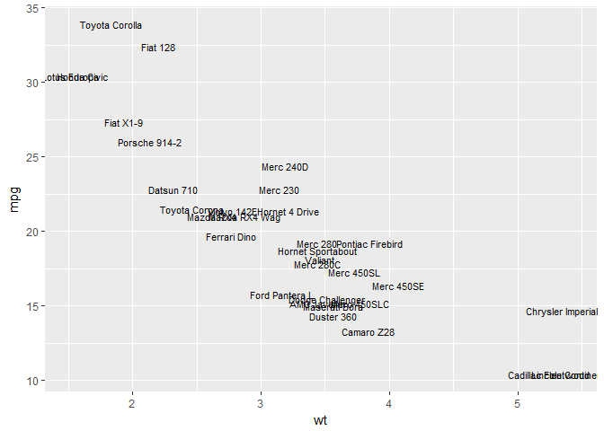<!-- -->

## Continuous Bivariabe Distribution
### Plot Types
- geom_bin2d(): 2d bin counts  
- geom_hex(): hexagon binning (package "hexbin" is required)  
- geom_density_2d(): adding contours from 2d density estimate  

### Heatmap Of 2d Bin Counts
#### Basics
- Definition: geom_bin2d() produces a scatter plot with rectangular bins. The number of observations is counted in each bin and displayed as a heatmap.
- Key function: geom_bin2d()
- Alternative functions: stat_bin_2d(), stat_summary_2d()
- Key arguments: alpha, color, fill, linetype, max, size, xmin, ymin, ymax

#### Examples

```r
data(diamonds)
head(diamonds[ , c("carat", "price")])
```

```
## # A tibble: 6 x 2
##   carat price
##   <dbl> <int>
## 1  0.23   326
## 2  0.21   326
## 3  0.23   327
## 4  0.29   334
## 5  0.31   335
## 6  0.24   336
```

```r
my_plot <- ggplot(diamonds, aes(carat, price))

# Default plot
my_plot + geom_bin2d()
```

<!-- -->

```r
# Change the number of bins
my_plot + geom_bin2d(bins = 15)
```

<!-- -->

```r
# Or specific the width of bins
my_plot + geom_bin2d(binwidth = c(1, 1000))
```

<!-- -->

```r
# Alternative functions
my_plot + stat_bin_2d()
```

<!-- -->

```r
my_plot + stat_summary_2d(aes(z = depth))
```

<!-- -->

### Heatmap With Hexagon Binning
- Key functions: geom_hex()
- Alternative functions: stat_bin_hex(), stat_summary_hex()
- Key arguments: alpha, color, fill, size


```r
# install.packages("hexbin")
library(hexbin)

# Default plot
my_plot + geom_hex()
```

<!-- -->

```r
# Change the number of bins
my_plot + geom_hex(bins = 10)
```

<!-- -->

```r
# Alternative functions
my_plot + stat_bin_hex()
```

<!-- -->

```r
my_plot = stat_summary_hex(aes(z = depth))
```

### Scatter Plots With 2d Density Estimation
- Key function: geom_density_2d()
- Alternative function: stat_density_2d()
- Key arguments: alpha, color, linetype, size


```r
data("faithful")

# Scatter plot
sp <- ggplot(
  faithful,
  aes(
    x = eruptions,
    y = waiting))

# Default plot
sp + geom_density_2d(color = "#E7B800")
```

<!-- -->

```r
# Add points
sp + geom_point(color = "#00AFBB") +
  geom_density_2d(color = "#E7B800")
```

<!-- -->

```r
# Use stats_density_2d with geom = "polygon"
sp + geom_point() +
  stat_density_2d(
    aes(fill = ..level..),
    geom = "polygon")
```

<!-- -->

```r
# Change the gradient color
sp + geom_point() +
  stat_density_2d(
    aes(fill = ..level..),
    geom = "polygon") +
  scale_fill_gradient(
    low = "#00AFBB",
    high = "#FC4E07")
```

<!-- -->

```r
# Alternative function
sp + geom_density_2d()
```

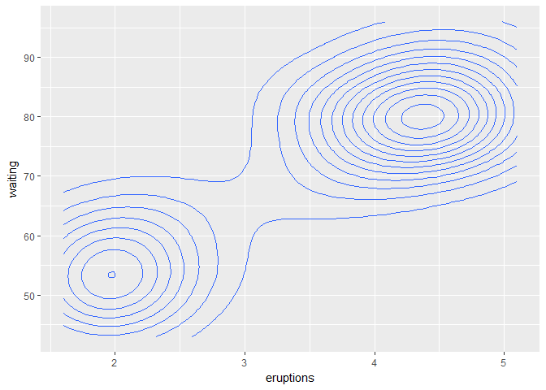<!-- -->

#### See also
- geom_contour()
- stat_contour()

### Continuous Function
#### Basics
- Key functions: geom_area(), geom_line(), geom_step()
- Alternative functions: none
- Key arguments: alpha, color, fill (for geom_area() only), linetype, size

#### Plot Types
- geom_area(): area plot
- geom_line(): line plot with ordered observations ordered by x
- geom_step(): connecting observations by stairs

#### Examples

```r
data(economics)
head(economics)
```

```
## # A tibble: 6 x 6
##         date   pce    pop psavert uempmed unemploy
##       <date> <dbl>  <int>   <dbl>   <dbl>    <int>
## 1 1967-07-01 507.4 198712    12.5     4.5     2944
## 2 1967-08-01 510.5 198911    12.5     4.7     2945
## 3 1967-09-01 516.3 199113    11.7     4.6     2958
## 4 1967-10-01 512.9 199311    12.5     4.9     3143
## 5 1967-11-01 518.1 199498    12.5     4.7     3066
## 6 1967-12-01 525.8 199657    12.1     4.8     3018
```

```r
d <- ggplot(
  economics,
  aes(x = date,
      y = unemploy))

# Area plot
d + geom_area(fill = "#00AFBB", color = "white")
```

<!-- -->

```r
# Line plot, observations ordered by z
d + geom_line(color = "#E7B800")
```

<!-- -->

```r
# Stair plot
set.seed(1234)
sub_set <- economics[sample(1:nrow(economics), 15) , ]
ggplot(
  sub_set,
  aes(
    x = date,
    y = unemploy)) +
  geom_step(color = "#FC4E07")
```

<!-- -->

# Annotations
[^1] https://en.wikipedia.org/wiki/Scatter_plot
