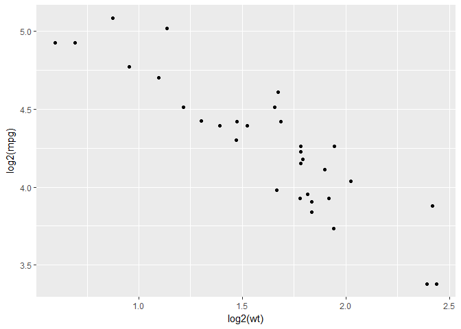

# Kassambra_Graphics_Notes
Georg Maubach  
19 Februar 2017  


```r
# install.packages(pkgs = "ggplot2", dependencies = TRUE, type = "source")
library(ggplot2)
# install.packages(pkgs = "dplyr", dependencies = TRUE, type = "source")
library(dplyr)
```

```
## 
## Attaching package: 'dplyr'
```

```
## The following objects are masked from 'package:stats':
## 
##     filter, lag
```

```
## The following objects are masked from 'package:base':
## 
##     intersect, setdiff, setequal, union
```

# Introduction to ggplot2

## Definition of plots

**Plot = data + Aesthetics + Geometry**

- data: a data frame  
- Aesthetics:
    1. indicate the x and y variables,  
    2. control color, size, shape of points, etc.  
- Geometry: defines the type of graphic, e. g. histogram, box plot, etc.

Geometry is defined in geom_*(). Geoms are called layers cause the can occur multiple times and put on top of each other.

## Data format and preparation

- **Data must be a data frame, containing all information to make a ggplot graphic.**  
- **Data should be tidy, i. e. columns should be variables, rows should be observations.**  


```r
# mtcars
## Load data
data(mtcars)
df <- mtcars[ , c("mpg", "cyl", "wt")]

## Convert dyl to a factor variable
df$cyl <- as.factor(df$cyl)

## Print a sample of data
head(mtcars)
```

```
##                    mpg cyl disp  hp drat    wt  qsec vs am gear carb
## Mazda RX4         21.0   6  160 110 3.90 2.620 16.46  0  1    4    4
## Mazda RX4 Wag     21.0   6  160 110 3.90 2.875 17.02  0  1    4    4
## Datsun 710        22.8   4  108  93 3.85 2.320 18.61  1  1    4    1
## Hornet 4 Drive    21.4   6  258 110 3.08 3.215 19.44  1  0    3    1
## Hornet Sportabout 18.7   8  360 175 3.15 3.440 17.02  0  0    3    2
## Valiant           18.1   6  225 105 2.76 3.460 20.22  1  0    3    1
```

```r
#----------------------------------------------------------
library(dplyr)

set.seed(1234)
wdata <- data.frame(
  sex = factor(rep(c("F", "M"), each = 200)),
  weight = c(rnorm(200, 55), rnorm(200, 58)))

head(wdata)
```

```
##   sex   weight
## 1   F 53.79293
## 2   F 55.27743
## 3   F 56.08444
## 4   F 52.65430
## 5   F 55.42912
## 6   F 55.50606
```

```r
mu <- wdata %>%
  group_by(sex) %>%
  summarise(grp.mean = mean(weight))

head(mu)
```

```
## # A tibble: 2 × 2
##      sex grp.mean
##   <fctr>    <dbl>
## 1      F 54.94224
## 2      M 58.07325
```

## ggplot Basics
### ggplot basic example

```r
# Basic scatter plot
ggplot(data = mtcars, aes(x = wt, y = mpg)) +
  geom_point()
```

<!-- -->

```r
# Change the font size and shape
ggplot(data = mtcars, aes(x = wt, y = mpg)) +
   geom_point(size = 1.5, shape = 18)
```

<!-- -->

### aes_string()
aes_string() generates aesthetics from a string. This is particularly useful when writing functions that create plots cause strings can be used to define aesthetic mappings. Otherwise it would be needed to use a substitute to generate a call to aes().


```r
ggplot(data = mtcars, aes_string(x = "wt", y = "mpg")) +
   geom_point(size = 1.5, shape = 18)
```

<!-- -->

```r
ggpoints <- function(data, x_name, y_name)
{
  p <- ggplot(data = data, aes_string(x_name, y_name)) +
    geom_point(color = "red") +
    geom_smooth()
  
  return(p)
}

ggpoints(data = mtcars, x_name = "wt", y_name = "mpg")
```

```
## geom_smooth: method="auto" and size of largest group is <1000, so using loess. Use 'method = x' to change the smoothing method.
```

<!-- -->

### Visualise transformations of original dataset
Some plots visualise a transformation on the original data set. In this case, an alternative way to build a layer is to use stat_*() functions.


```r
set.seed(1234)
wdata = data.frame(
  sex = factor(rep(c("F", "M"), each = 200)),
  weight = c(rnorm(200, 55), rnorm(200, 58)))

print("Use geometry function")
```

```
## [1] "Use geometry function"
```

```r
ggplot(wdata, aes(x = weight)) + geom_density()
```

<!-- -->

```r
print("Use stat function")
```

```
## [1] "Use stat function"
```

```r
ggplot(wdata, aes(x = weight)) + stat_density()
```

<!-- -->

### Layers using geoms
Each plot consists of one or more layers. Layers are defined using geom_*().

#### Using the same data and same aesthetic mapping in one plot

```r
ggplot(data = mtcars, aes(x = wt, y = mpg)) +
  geom_point() +  # to draw points
  geom_line()     # to draw a line
```

<!-- -->

#### Using different data and mappings for different layers

```r
ggplot(data = mtcars, aes(x = wt, y = mpg)) +
  geom_point() +  # to draw points from whole data set
  geom_line(data = head(mtcars), color = "red")  # to draw a line from a subset of data
```

<!-- -->

### Calculations in aes()

```r
ggplot(data = mtcars, aes(x = log2(wt), y = log2(mpg))) +
  geom_point()
```

<!-- -->

### Saving plots
- Plots can be stored as a variable and printed using print().  
- last_plot(): returns last plot modified  
- ggsave("plot.png", width = 5, height = 5): save the last plot to the current working directory  

#### Saving directly from screen

```r
ggplot(mtcars, aes(wt, mpg)) + geom_point()
```

<!-- -->

```r
ggsave("my_plot1.pdf")  # to PDF
```

```
## Saving 7 x 5 in image
```

```r
ggsave("my_plot1.png")  # to PNG
```

```
## Saving 7 x 5 in image
```

#### Saveing graphic objects

```r
pdf("my_plot2.pdf")
my_plot <- ggplot(mtcars, aes(wt, mpg)) + geom_point()
print(my_plot)
dev.off()
```

```
## png 
##   2
```

```r
png("my_plot2.png")
my_plot <- ggplot(mtcars, aes(wt, mpg)) + geom_point()
print(my_plot)
dev.off()
```

```
## png 
##   2
```

# Plotting **ONE** variable (discrete or continuous)


```r
library(dplyr)

set.seed(1234)
wdata <- data.frame(
  sex = factor(rep(c("F", "M"), each = 200)),
  weight = c(rnorm(200, 55), rnorm(200, 58)))

head(wdata)
```

```
##   sex   weight
## 1   F 53.79293
## 2   F 55.27743
## 3   F 56.08444
## 4   F 52.65430
## 5   F 55.42912
## 6   F 55.50606
```

```r
mu <- wdata %>%
  group_by(sex) %>%
  summarise(grp.mean = mean(weight))

head(mu)
```

```
## # A tibble: 2 × 2
##      sex grp.mean
##   <fctr>    <dbl>
## 1      F 54.94224
## 2      M 58.07325
```


```r
my_plot <- ggplot(wdata, aes(x = weight))
```

## Overview of possible graphics

### Discrete Variables

- geom_bar(): bar plot

### Continuous Variables

- geom_area():      area plot
- geom_density():   density plot
- geom_dotplot():   dot plot
- geom_freqpoly():  frequency polygon
- geom_histogram(): histogram plot
- geom_ecdf():      empirical cumulative density function
- stat_qq():        quantile-quantile plot

## Bar plot

## Area Plot
### Basics
- Definitio: Area plots are the continuous analog to a stacked bar chart.
- Key function: geom_area()
- Alternative function: stat_bin()
- Key arguments: alpha, color, fill, linetype, size

### Example 1: y Values Corresponding to the Count of x Values


```r
my_plot + geom_area(stat = "bin", color = "black", fill = '#00AFBB')
```

```
## stat_bin: binwidth defaulted to range/30. Use 'binwidth = x' to adjust this.
```

<!-- -->

### Example 2: y Values Corresponding to the Density of x Values

```r
my_plot + geom_area(aes(y = ..density..), stat = "bin")
```

```
## stat_bin: binwidth defaulted to range/30. Use 'binwidth = x' to adjust this.
```

<!-- -->

### Comparison of Bar Plot and Area Plot

```r
data("diamonds")
head(diamonds)
```

```
##   carat       cut color clarity depth table price    x    y    z
## 1  0.23     Ideal     E     SI2  61.5    55   326 3.95 3.98 2.43
## 2  0.21   Premium     E     SI1  59.8    61   326 3.89 3.84 2.31
## 3  0.23      Good     E     VS1  56.9    65   327 4.05 4.07 2.31
## 4  0.29   Premium     I     VS2  62.4    58   334 4.20 4.23 2.63
## 5  0.31      Good     J     SI2  63.3    58   335 4.34 4.35 2.75
## 6  0.24 Very Good     J    VVS2  62.8    57   336 3.94 3.96 2.48
```

```r
p <- ggplot(diamonds, aes(x = price, fill = cut))

p + geom_bar(stat = "bin")
```

```
## stat_bin: binwidth defaulted to range/30. Use 'binwidth = x' to adjust this.
```

<!-- -->

```r
p + geom_area(stat = "bin")
```

```
## stat_bin: binwidth defaulted to range/30. Use 'binwidth = x' to adjust this.
```

<!-- -->

## Density Plot
### Basics
- Density plots are useful to visualise the distribution of a continuous variable.
- Key function: geom_density()
- Alternative function: stat_density()
- Key arguments: alpha, color, fill, linetype, size
- References
    1. https://en.wikipedia.org/wiki/Density_estimation
    2. https://de.wikipedia.org/wiki/Kerndichtesch%C3%A4tzer

### Example 1

```r
my_plot + geom_density()
```

<!-- -->

```r
my_plot + geom_density(color = "black", fill = "grey") +
  geom_vline(aes(xintercept = mean(weight)),
             color = "#FC4E07", 
             linetype = "dashed",
             size = 1)
```

<!-- -->

### Groupings
#### Example 1: Line Color by Sex

```r
my_plot + geom_density(aes(color = sex))
```

<!-- -->

#### Example 2: Fill Color by Sex, semi-transparent fill (alpha = 0.4)

```r
my_plot + geom_density(aes(fill = sex), 
                       alpha = 0.4)
```

<!-- -->

#### Example 3: Line Color and Mean Line by Sex

```r
head(mu)
```

```
## # A tibble: 2 × 2
##      sex grp.mean
##   <fctr>    <dbl>
## 1      F 54.94224
## 2      M 58.07325
```

```r
my_plot + geom_density(aes(color = sex), 
                        alpha = 0.4) +
  geom_vline(data = mu,
             aes(xintercept = grp.mean, 
                 color = sex),
             linetype = "dashed")
```

<!-- -->

### Graphic Property Control
#### Basics
- scale_color_manual(), scale_fill_manual(): use custom colors
- scale_color_brewer(), scale_fill_brewer(): use color palette from RColorBrewer package
- scale_color_grey(), scale_fill_grey():     use grey color palettes

#### Manually Defined Lines
##### Example 0: Create Basic Graphic

```r
my_plot_2 <- my_plot + 
  geom_density(aes(color = sex)) +
  geom_vline(data = mu,
             aes(xintercept = grp.mean, 
                 color = sex),
             linetype = "dashed") +
  theme_minimal()
```

##### Example 1: Manually Defined Color

```r
my_plot_2 + scale_color_manual(values = c("#999999", "#E69F00"))
```

<!-- -->

##### Example 2: Colors Using RColorBrewer Palettes

```r
my_plot_2 + scale_color_brewer(palette = "Paired")
```

<!-- -->

##### Example 3: Grey Scale

```r
my_plot_2 + scale_color_grey()
```

<!-- -->

#### Manually Defined Fills
##### Example 0: Create Basic Graphic

```r
my_plot_3 <- my_plot + 
  geom_density(aes(fill = sex), alpha = 0.4) +
  theme_minimal()
```

##### Example 1: Manuall Fill

```r
my_plot_3 + scale_fill_manual(
  values = c("#999999", "#E69F00"))
```

<!-- -->

##### Example 2: Fill with RColorBrewer Palettes Colors

```r
my_plot_3 + scale_fill_brewer(palette = "Dark2") +
  theme_minimal()
```

<!-- -->

##### Example 3: Fill with Grey Scale Colors

```r
my_plot_3 + scale_fill_grey() +
  theme_minimal()
```

<!-- -->

